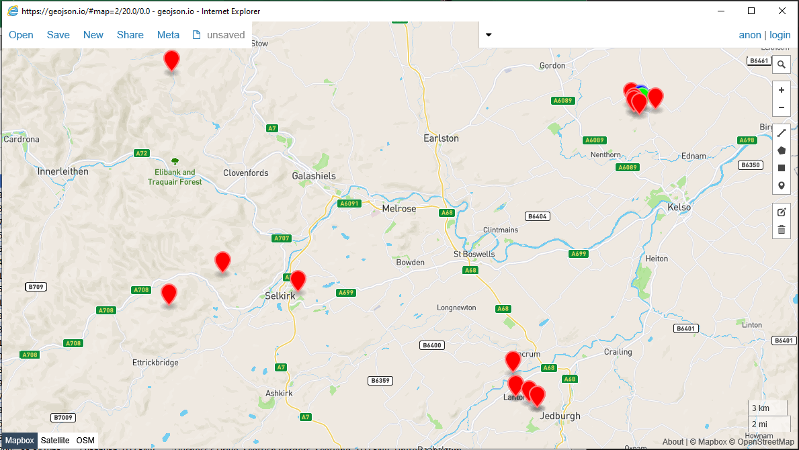

# vbWebMap

A simple map UI proof of concept written in VB6 compatible VBA



This map uses InternetExplorer COM object.

> Important: This currently relies on [GeoJSON.io](http://GeoJSON.io). It would be a lot better if it relied on some github.io page. I.E. something that wouldn't go down. However, on the whole this could prove useful as a basis for more resilient works. :)

The example supplied will visualise the linked table. Furthermore when you change row in Excel, the point displayed in the map will shift around also.


## VBA Classes

### `vbWebMap`

Driver for the web map. Contains a few subs to add layers, set the bounds of the map, and pan to a point.

```vb
'Constructors
create()

'Properties and methods
api                                                                            'entry point to window.api
leaflet                                                                        'entry point to window.L
panTo(lat as double,lng as double)                                             'pan to a point
setBounds(lat1 as double,lng1 as double,lat2 as double,lng2 as double)         'sets the bounds of the webmap to a rect
addLayer(layer as gisFeatureCollection)                                        'sets the active layer
getMarkerStyle(ByVal color As Long, sym As EMarkerSymbol, size As EMarkerSize) 'helper for styling markers
isIERunning                                                                    'property to test whether IE is running or not
```

### `gisFeatureCollection`

Creates a geoJSON layer.

```vb
With featureCol
'Constructors
create()
 
'Properties and methods
AddPoint(ByVal point As gisIPoint, Optional ByVal Data As Object)                                                           'Add a point to the collection. Optionally include data.
AddPoint2(ByVal Latitude As Double, ByVal Longitude As Double, Optional ByVal Data As Object)                               'Add a point to the collection. Optionally include data.
AddLine(ByVal oStart As gisIPoint, oEnd As gisIPoint, Optional ByVal Data As Object)                                        'Add a line to the collection. Optionally include data.
AddLine2(ByVal StartLat As Double, StartLong As Double, EndLat As Double, EndLong As Double, Optional ByVal Data As Object) 'Add a line to the collection. Optionally include data.
AddPolygon(ByVal vPolygon As Variant, Optional ByVal Data As Object)                                                        'Add a polygon to the collection. Optionally include data.
AddPolyLine(ByVal vPolyline As Variant, Optional ByVal Data As Object)                                                      'Add a line to the collection. Optionally include data.
ToString()                                                                                                                  'returns the layer as geoJSON
object                                                                                                                      'obtain the object itself (not really used)
bounds                                                                                                                      'obtain bounding rect as array
```

### `gisOSGB36`

Implements `gisIPoint`. Handles OSGB36 to LatLng conversion.

```vb
'Constructors
Create(ByVal Eastings As Double, ByVal Northings As Double) As gisOSGB36             'Creates point from eastings and northings
CreateFromLatLng(ByVal fLatitude As Double, ByVal fLongitude As Double) As gisOSGB36 'Creates point from latitude and longitude (can convert to Eastings Northings this way)
CreateFromString(ByVal sGridReference As String) As gisOSGB36                        'Creates point from string. Numerous formats are allowed including:
                                                                                     '  123456-123456
                                                                                     '  SK123456
                                                                                     '  SK1234567890

'Properties and methods
Eastings             'eastings coord
Northings            'northings coord
Latitude             'latitude coord
Longitude            'longitude coord
gisIPoint_Latitude   'latitude coord
gisIPoint_Longitude  'longitude coord
```

### `gisIPoint`

Interface containing `Latitude()` and `Longitude()` functions.
